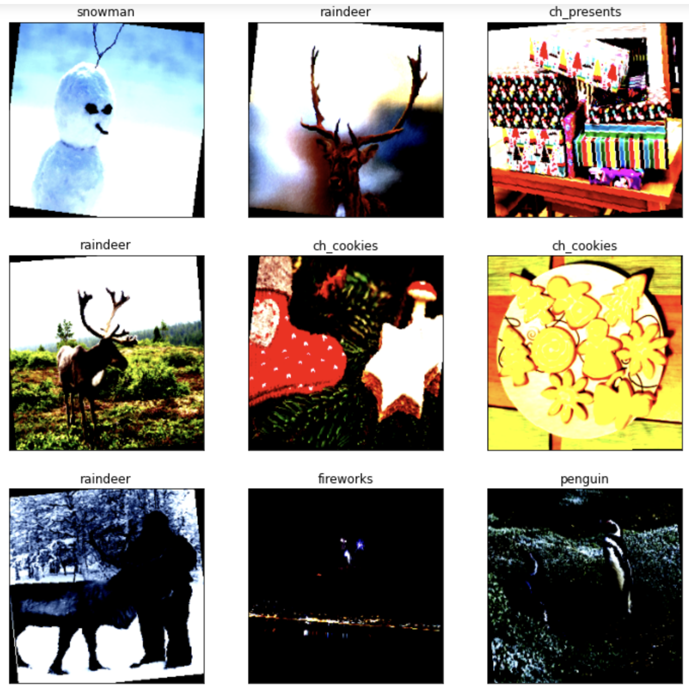
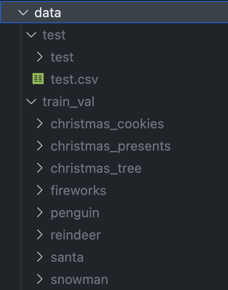
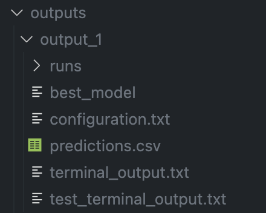

# Christmas Images Classification

Classification performed on Christams backdrop Images of 8 classes like 'Christmas Cookies', 'Christmas Presents', 'Christmas Tree', 'Fireworks', 'Penguin', 'Raindeer', 'Santa', 'Snowman'.



## Introduction
The Data has 3736 images of different sizes and intensities for training and evaluating and 160 images for testing images. To enhance the training dataset, Data augmentations such as random cropping, flipping, rotating, and normalization were applied.

Transfer learning was employed using EfficientNet B4, and ConvNeXt Tiny from torch vision models trained on the ImageNet dataset, with the ConvNeXt Tiny model achieving a remarkable accuracy of 92% using pretrained weights.

## Requirements

See requirements.txt file

## Setup

1.  Install PyTorch and other required Python libraries in a virtual environment with:

    ```
    pip install -r requirements.txt
    ```

2.  Download Data: Download data and follow the below image for hierarchy.
    Data contains two folder:
    1. `train_val` (contains folders of images for training and validation).
    2. `test`, it has a `test` (sub folder that contains testing images) 
        and `test.csv` containing ground truth labels of test images.

   

## Usage

`python main.py` executes and runs the code with all the default arguments.

For changing the default arguments follow the below instructions:

1. model selection: 

    pretrained convnext_tiny model as a model: `python main.py --model convnext`

    pretrained efficientnetb4 model as a model: `python main.py --model efficientnetb4`

3. model parameters:
    
    Validation and training data split ratio, Train loader Batch size, Validation loader Batch size, epochs, learning rate, and hidden units are some of the neural net parameters that can be altered through command line.

    `python main.py --model efficientnetb4 --valtrainsplit 0.2 --trainbatchsize 4 --valbatchsize 4 --epochs 30 --learningrate 0.001 --weightdecay 0.0001`
    
    `python main.py -m efficientnetb4 -vts 0.2 -tbs 4 -vbs 4 -e 30 -lr 0.001 -wd 0.0001`


## Outputs

The output of the network is saved in Outputs folder. 
Output contains:
1. `best_model` (weights of model with highest validation accuracy).
2. `configuration.txt` (text file with model configurations).
3. `terminal_output.txt` (terminal output during training and evaluation).
4. `./runs` (folder with logs of tensorboard).

## Testing

For testing use evaluate.py file. Update the following path in the file.
for example:
### dataset location
path = `./data/test`
### Output path location
ouput_path = `./outputs/output_1`

After updating, run `python evaluate.py` this save two more files in output folder.

5. `predictions.csv` (Contains prediction of the test images).
6. `test_terminal_output` (terminal output during testing)

The output folder looks as below after training and testing.

